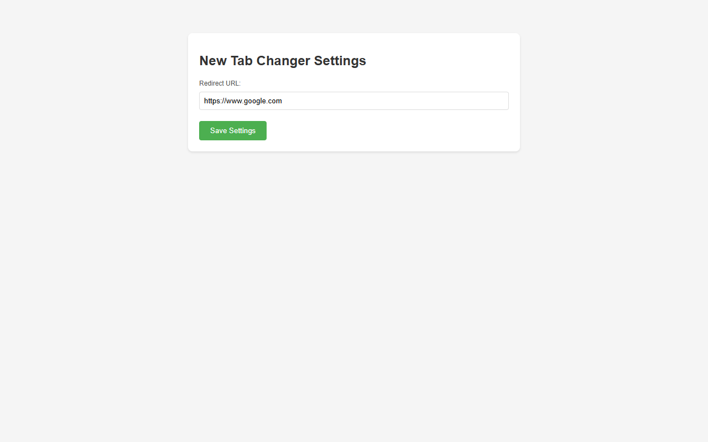

# NewTabChanger

NewTabChanger is a Chrome extension that allows you to customize your new tab page by redirecting it to any URL of your choice. Instead of the default Chrome new tab page, you can set it to open your favorite website, a custom dashboard, or any other web page you prefer.

## Screenshot

## Features

- Customize your new tab page with any URL
- Simple and intuitive settings interface
- Fallback to Google if no custom URL is set
- Lightweight and fast

## Installation

### Chrome Web Store

You can install NewTabChanger directly from the Chrome Web Store:

[Install NewTabChanger](https://chromewebstore.google.com/detail/new-tab-changer/fliddbilblbeijgafickmllbbbgejngp)

### Manual Installation (For Development)

1. Download or clone this repository
2. Open Chrome and go to `chrome://extensions/`
3. Enable "Developer mode" in the top right corner
4. Click "Load unpacked" and select the extension directory

## Usage

1. Click on the extension icon in your Chrome toolbar
2. Enter your desired URL in the settings page
3. Open a new tab to see it in action!

## License
This project is licensed under the MIT License - see the [LICENSE](LICENSE) file for details.